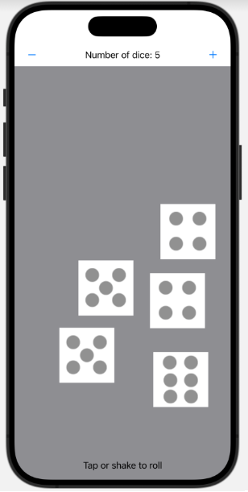
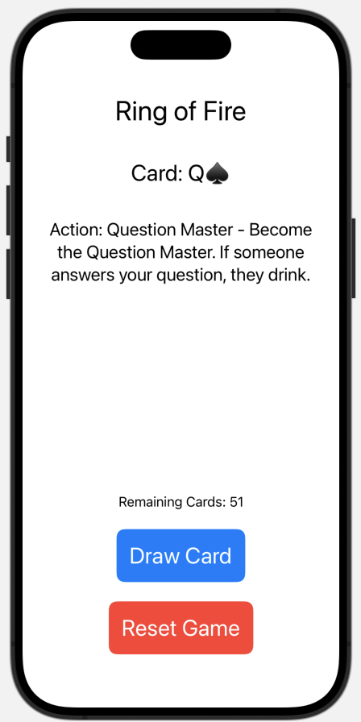
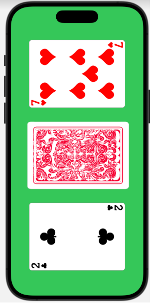

# iOS App: Drinking Games

## Overview

`ios_app_drinking_games` is an iOS application that features a variety of fun and engaging drinking games, designed to be enjoyed with friends. The app currently includes three main games:

1. **Dice Roll Game**: Roll customizable dice and see what luck brings.
2. **Ring of Fire**: A classic card-based drinking game where each card drawn has a specific action.
3. **Penalty Card Game**: A quick card game where players win or lose depending on the middle card.

## Games

### 1. Dice Roll Game

In the Dice Roll Game, users can adjust the number of dice to roll (up to 6 dice). Players can either tap the screen or shake the device to roll the dice, adding an element of chance to the gameplay.

- **Controls**:
  - `+` and `-` buttons: Increase or decrease the number of dice to roll.
  - Tap or shake the device to roll the dice.
- **Goal**: No strict rules apply; simply enjoy rolling dice and making up your own rules with friends!



### 2. Ring of Fire

Ring of Fire is a popular card-based drinking game where each card drawn triggers a specific action. The game continues until all 52 cards are drawn.

- **Game Rules**:
  - Tap `Draw Card` to reveal a card and follow the specific action displayed on the screen.
  - For example, drawing a Queen makes the player the "Question Master."
  - Tap `Reset Game` to shuffle the cards and restart.
- **Goal**: Follow the game's prompts and have fun as each card results in different actions.



### 3. Penalty Card Game

The Penalty Card Game is a quick and simple game of chance that challenges players to determine whether the middle card lies between the left and right cards.

- **Game Rules**:
  - Tap the left card to reveal it.
  - Tap the right card to reveal it.
  - Tap the middle card to reveal it last.
  - If the middle card's value is between the left and right cards, the player wins.
  - If the middle card is equal to either the left or right card, the player loses double.
  - If the middle card does not lie between or equal the left or right card, the player loses single.
- **Goal**: Predict whether the middle card will lie between or match the other two cards.
- 


## Installation

To install and run the app, follow these steps:

1. Clone the repository from GitHub.
   ```bash
   git clone https://github.com/tonylai2022/ios_app_drinking_games.git
2. Open the project in Xcode.

3. Build and run the app on an iOS device or simulator.
